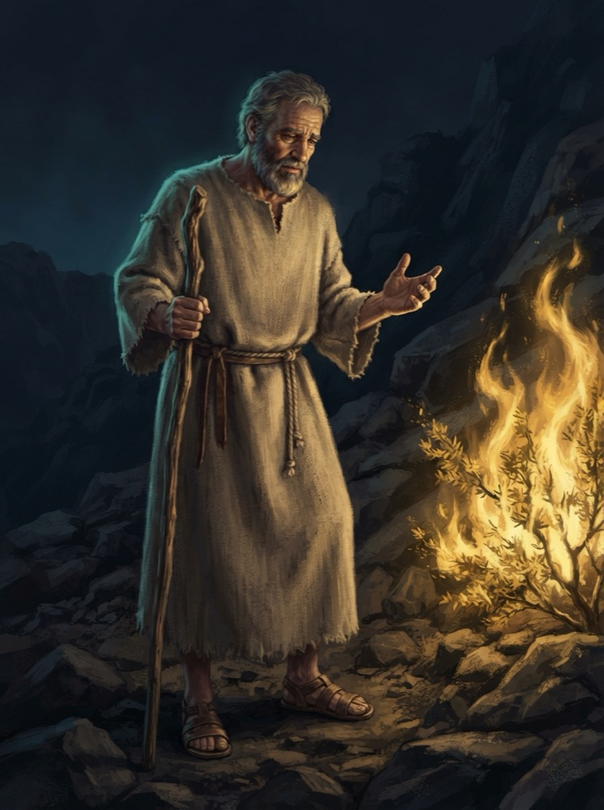
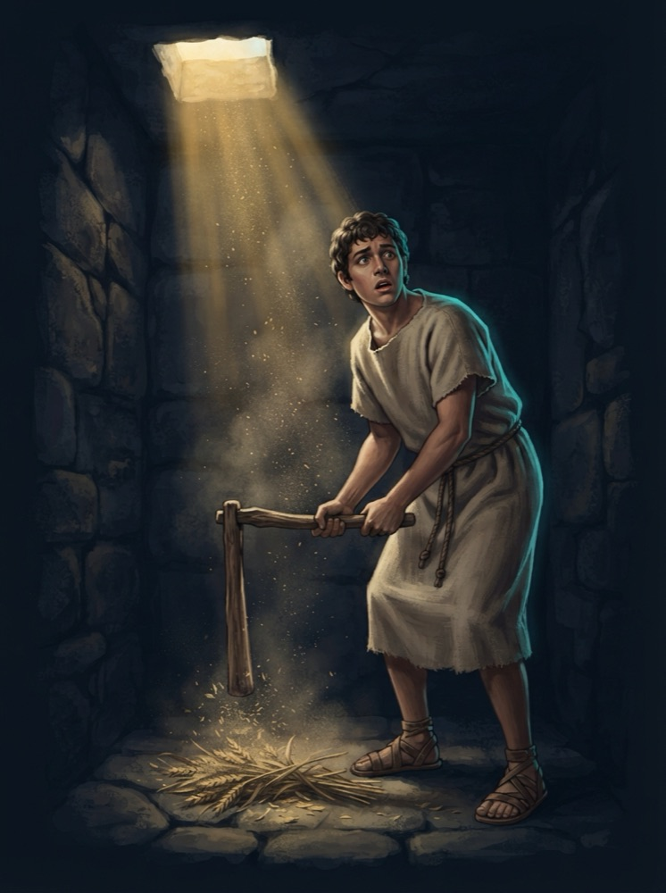
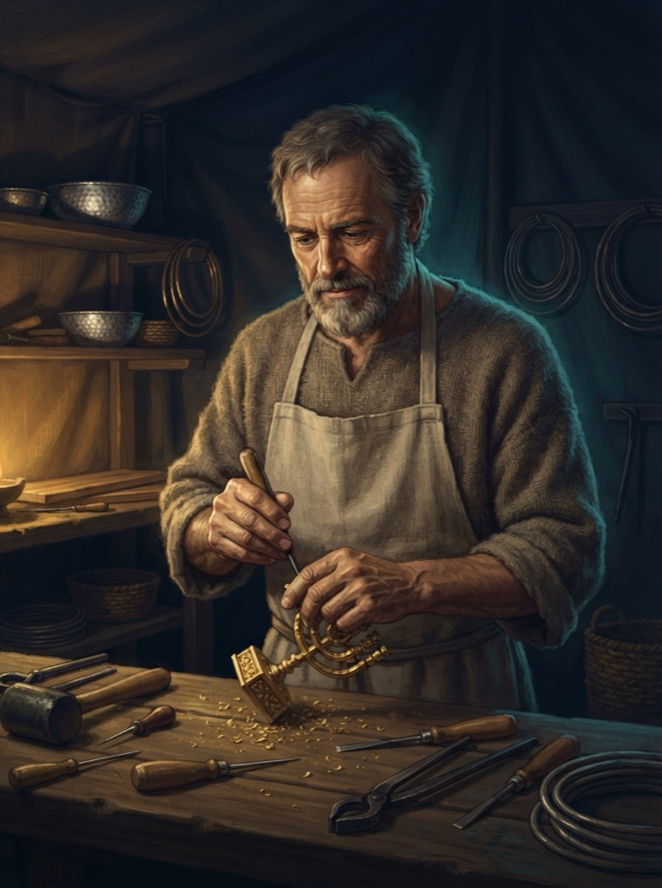
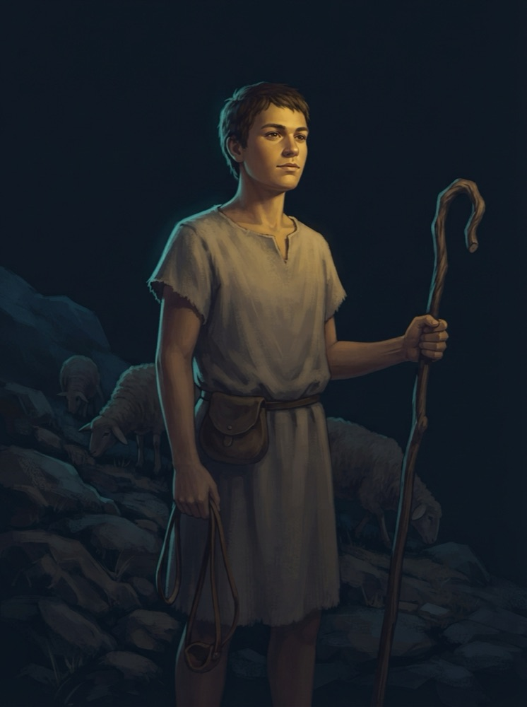
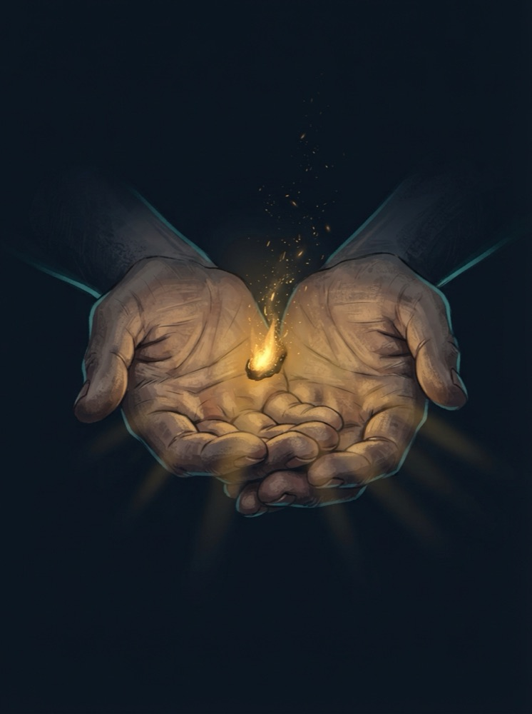
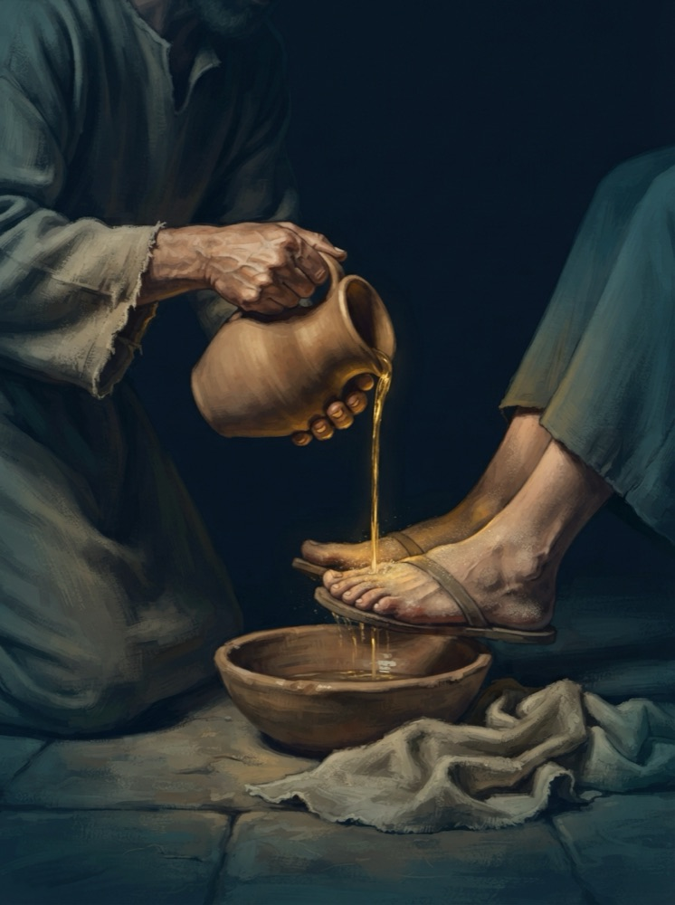
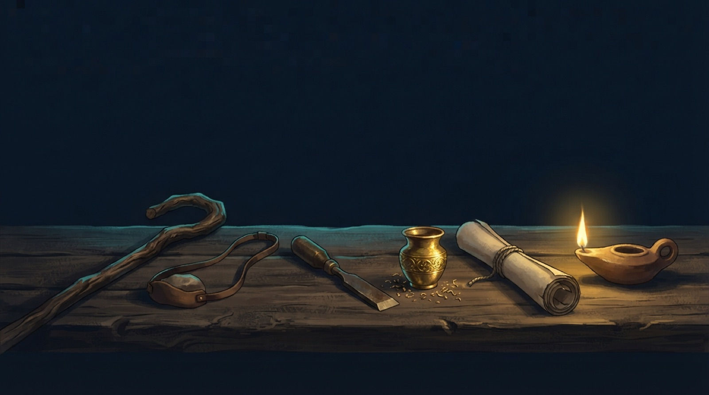

# Мои дары и таланты – промпты для генерации иллюстраций

Сгенерированные картинки класть в `img/` под указанными именами – слоты ниже подхватят их автоматически, править ничего не нужно.

## Навигация

1. [Моисей](#1-моисей) – `img/moses.jpg`
2. [Гедеон](#2-гедеон) – `img/gideon.jpg`
3. [Веселеил](#3-веселеил) – `img/bezalel.jpg`
4. [Давид](#4-давид) – `img/david.jpg`
5. [Дар (символическая)](#5-дар-символическая) – `img/gift-light.jpg`
6. [Служение (символическая)](#6-служение-символическая) – `img/serving-hands.jpg`
7. [Титульный слайд (фон)](#7-титульный-слайд-фон) – `img/title-bg.jpg`

## Общий стилевой суффикс

Добавлять в конец каждого промпта:

```
Style: cinematic digital painting, dramatic chiaroscuro lighting, semi-realistic
illustration, muted palette of deep navy blue (#0F1B2D) background, warm gold
(#D4A843) key light and teal (#5B8CA8) rim light. Textured brushwork, restrained
detail, no text, no lettering, no watermark. Portrait orientation 3:4, subject
framed from the waist up, dark negative space around the figure.
```

---

## 1. Моисей

Слайд «Моисей» (портрет во всю высоту слева) + миниатюра на титульном слайде.

```
A hesitant Middle Eastern shepherd in his later years standing before a burning
bush on a rocky desert slope at Horeb, one hand raised slightly as if protesting,
eyes lowered in self-doubt. Simple coarse wool robe, weathered face, wooden staff
in the other hand. The bush burns with warm golden flames that do not consume it,
casting the key light on his face. Historically grounded Bronze Age Midian:
undyed wool, leather sandals, rope belt.
Style: cinematic digital painting, dramatic chiaroscuro lighting, semi-realistic
illustration, muted palette of deep navy blue (#0F1B2D) background, warm gold
(#D4A843) key light and teal (#5B8CA8) rim light. Textured brushwork, restrained
detail, no text, no lettering, no watermark. Portrait orientation 3:4, subject
framed from the waist up, dark negative space around the figure.
```



---

## 2. Гедеон

Слайд «Гедеон» (портрет во всю высоту слева) + миниатюра на титульном слайде.

```
A young Israelite man threshing wheat while hiding inside a stone winepress pit,
glancing upward with a mix of fear and surprise, grain dust floating in a shaft
of warm golden light falling into the pit from above. Simple undyed linen tunic,
leather cord, wooden threshing flail in his hands. Historically grounded Late
Bronze Age Canaan, cramped stone walls around him, teal rim light outlining his
shoulders.
Style: cinematic digital painting, dramatic chiaroscuro lighting, semi-realistic
illustration, muted palette of deep navy blue (#0F1B2D) background, warm gold
(#D4A843) key light and teal (#5B8CA8) rim light. Textured brushwork, restrained
detail, no text, no lettering, no watermark. Portrait orientation 3:4, subject
framed from the waist up, dark negative space around the figure.
```



---

## 3. Веселеил

Слайд «Веселеил» (портрет во всю высоту слева) + миниатюра на титульном слайде.

```
A focused Israelite master craftsman at a wooden workbench in a desert camp tent,
engraving an ornate golden object with a bronze chisel, fine gold shavings
catching the warm key light. Concentrated calm expression, strong hands, simple
linen apron over a wool tunic. Around him: tools, hammered silver bowls, acacia
wood planks. Historically grounded Exodus-era wilderness tabernacle workshop.
Style: cinematic digital painting, dramatic chiaroscuro lighting, semi-realistic
illustration, muted palette of deep navy blue (#0F1B2D) background, warm gold
(#D4A843) key light and teal (#5B8CA8) rim light. Textured brushwork, restrained
detail, no text, no lettering, no watermark. Portrait orientation 3:4, subject
framed from the waist up, dark negative space around the figure.
```



---

## 4. Давид

Слайд «Давид» (портрет во всю высоту слева) + миниатюра на титульном слайде.

```
A ruddy teenage shepherd standing on a rocky Judean hillside at dusk, a leather
sling hanging loosely from one hand, a shepherd's staff in the other, calm and
confident gaze into the distance. A few sheep graze behind him in the shadows.
Simple short wool tunic, leather pouch at his belt. Warm gold light on his face,
teal rim light from the twilight sky. Historically grounded Iron Age Israel.
Style: cinematic digital painting, dramatic chiaroscuro lighting, semi-realistic
illustration, muted palette of deep navy blue (#0F1B2D) background, warm gold
(#D4A843) key light and teal (#5B8CA8) rim light. Textured brushwork, restrained
detail, no text, no lettering, no watermark. Portrait orientation 3:4, subject
framed from the waist up, dark negative space around the figure.
```



---

## 5. Дар (символическая)

Слайд «Вопрос в зал» – вертикальная картинка справа.

```
A symbolic still life: open weathered hands presenting a small glowing ember of
warm golden light, rays gently spilling between the fingers into surrounding
darkness, tiny sparks rising. No faces, hands only, emerging from deep navy
shadow. Mood of quiet potential and something precious waiting to be used.
Style: cinematic digital painting, dramatic chiaroscuro lighting, semi-realistic
illustration, muted palette of deep navy blue (#0F1B2D) background, warm gold
(#D4A843) key light and teal (#5B8CA8) rim light. Textured brushwork, restrained
detail, no text, no lettering, no watermark. Portrait orientation 3:4, subject
framed from the waist up, dark negative space around the figure.
```



---

## 6. Служение (символическая)

Слайд «Как узнать свой дар?» – вертикальная картинка справа.

```
A symbolic scene: two pairs of hands, one pouring water from a simple clay
pitcher over the dusty feet of another person, warm golden light on the water
stream, teal shadows around. Humble first-century setting: clay bowl, rough
linen towel, stone floor. No faces visible, focus on the act of serving.
Style: cinematic digital painting, dramatic chiaroscuro lighting, semi-realistic
illustration, muted palette of deep navy blue (#0F1B2D) background, warm gold
(#D4A843) key light and teal (#5B8CA8) rim light. Textured brushwork, restrained
detail, no text, no lettering, no watermark. Portrait orientation 3:4, subject
framed from the waist up, dark negative space around the figure.
```



---

## 7. Титульный слайд (фон)

Фон титульного слайда на весь экран (картинка показывается с затемнением ~55%, заголовок – поверх). **Горизонтальная, 16:9** – стилевой суффикс здесь свой, встроен в промпт.

```
A wide cinematic still life on a long rough ancient wooden table emerging from
deep navy darkness: a shepherd's wooden staff and a leather sling, a bronze
chisel beside a small ornate golden vessel with fine gold shavings, a rolled
parchment scroll, a clay oil lamp burning with a single warm golden flame as the
main light source. Each object catches warm gold light with subtle teal rim
highlights, symbolizing different God-given gifts waiting to be picked up. No
people, no hands, no faces.
Style: cinematic digital painting, dramatic chiaroscuro lighting, semi-realistic
illustration, muted palette of deep navy blue (#0F1B2D) background, warm gold
(#D4A843) key light and teal (#5B8CA8) rim light. Textured brushwork, restrained
detail, no text, no lettering, no watermark. Landscape orientation 16:9, objects
arranged along the lower half of the frame, generous dark negative space in the
upper half for a title.
```


